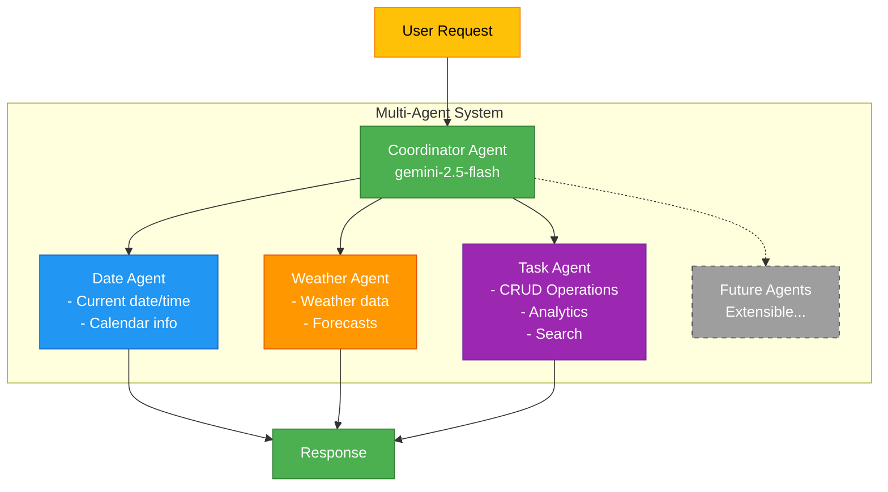

# Multi-Agent System with Google ADK

[](https://www.python.org/downloads/)
[](https://fastapi.tiangolo.com/)
[](https://google.github.io/adk-docs/)
[](LICENSE)
[](https://github.com/psf/black)
[](docs/ARCHITECTURE.md)
[](docs/)
[](src/agents/)
[](http://localhost:8000/docs)
[](https://www.sqlite.org/)

> **A comprehensive reference implementation for building production-ready multi-agent systems using Google's Agent Development Kit (ADK) for Python**

This project demonstrates best practices for architecting, implementing, and deploying a sophisticated multi-agent system with the following capabilities:

- **Multi-Agent Architecture** - Coordinated agents with specialized responsibilities
- **Natural Language Interface** - Chat-based interaction via FastAPI
- **Task Management** - Full CRUD operations with analytics
- **Weather & Date Services** - External data integration examples
- **Persistent Storage** - SQLite database for sessions and tasks
- **Tool Integration** - 15+ custom tools for agent capabilities
- **Production Ready** - Clean architecture, error handling, documentation

## Project Stats


-brightgreen)


---

## Table of Contents

- [Quick Start](#quick-start)
- [Architecture Overview](#architecture-overview)
- [Project Structure](#project-structure)
- [Features](#features)
- [Installation](#installation)
- [Usage](#usage)
- [API Documentation](#api-documentation)
- [Development Guide](#development-guide)
- [Best Practices](#best-practices)
- [License](#license)

---

## Quick Start

### 1. Install Dependencies

```bash
uv sync
```

### 2. Configure Environment

Create `.env` file:

```bash
GOOGLE_GENAI_USE_VERTEXAI=FALSE
GOOGLE_API_KEY=your_google_api_key_here
```

### 3. Seed Sample Data

```bash
python scripts/seed_tasks.py
```

### 4. Start the API Server

```bash
python api.py
```

Access the API at `http://localhost:8000` or view interactive docs at `http://localhost:8000/docs`

**For detailed setup instructions**, see [`docs/QUICK_START.md`](docs/QUICK_START.md)

### Docker

Alternatively, run the entire stack with Docker:

```bash
# 1. Create .env file with your API key (see step 2 above)
# 2. Build and start
docker compose up --build
```

The API will be available at `http://localhost:8000`.

---

## Architecture Overview

This multi-agent system demonstrates a **hierarchical agent architecture** with specialization and coordination:



### Key Design Patterns

1. **Agent Specialization** - Each agent has focused responsibilities
2. **Coordinator Pattern** - Central router delegates to specialists
3. **Tool-based Extension** - Agents extend capabilities via tools
4. **Session Management** - Persistent conversation context
5. **Database Persistence** - Long-term data storage
6. **RESTful API** - Standard HTTP interface

---

## Project Structure

```
adk-demo/
├── README.md                           # This file - main documentation
├── api.py                              # Main entry point (97 lines, clean!)
├── pyproject.toml                      # Python dependencies (uv)
├── .env                                # Environment configuration
├── assistant.db                        # SQLite database (auto-created)
│
├── src/                                # Source code (modular architecture)
│   ├── agents/                         # Agent definitions
│   │   ├── __init__.py
│   │   └── agents.py                   # All agent configurations
│   │
│   ├── tools/                          # Tool functions for agents
│   │   ├── __init__.py
│   │   ├── date_weather_tools.py       # Date & weather utilities
│   │   └── task_tools.py               # Task management tools (12 functions)
│   │
│   ├── database/                       # Database managers
│   │   ├── __init__.py
│   │   ├── session_db.py               # Session & message storage
│   │   └── task_db.py                  # Task CRUD & analytics
│   │
│   ├── models/                         # Pydantic models
│   │   ├── __init__.py
│   │   └── schemas.py                  # Request/Response models
│   │
│   └── routers/                        # API Routes
│       ├── __init__.py
│       ├── sessions.py                 # Session & chat endpoints
│       └── tasks.py                    # Task CRUD & analytics endpoints
│
├── scripts/                            # Utility scripts
│   └── seed_tasks.py                   # Database seeding
│
└── docs/                               # Documentation
    ├── QUICK_START.md                  # 5-minute setup guide
    ├── API_REFERENCE.md                # Session/chat API docs
    ├── TASK_MANAGEMENT.md              # Task management API docs
    ├── ARCHITECTURE.md                 # Architecture deep dive
    └── GOOGLE_ADK_REFERENCE.md         # ADK documentation
```

---

## Features

### 1. **Multi-Agent System**

- **Coordinator Agent** - Intelligent query routing
- **Date Agent** - Current date, time, calendar queries
- **Weather Agent** - Weather information (mock data, easily extensible)
- **Task Management Agent** - Full task lifecycle management

### 2. **Task Management System**

- **CRUD Operations** - Create, Read, Update, Delete tasks
- **Analytics** - Statistics, completion rates, trends
- **Advanced Queries**
  - Overdue tasks
  - Tasks due soon (customizable timeframe)
  - Tasks by location
  - Tasks by date range
  - Full-text search
- **Rich Metadata**
  - Priorities (low, medium, high)
  - Status tracking (pending, in_progress, completed)
  - Due dates
  - Locations
  - Weather notes

### 3. **RESTful API with Clean Architecture**

- **Router-Based Organization** - Modular endpoint structure
- **Pydantic Models** - Type-safe request/response validation
- **Session Management** - Create and manage chat sessions
- **Conversation History** - Persistent message storage
- **Task Endpoints** - Direct CRUD access
- **Analytics Endpoints** - Query and reporting
- **Interactive Docs** - Auto-generated Swagger UI
- **Scalable Design** - Easy to extend and maintain

### 4. **Natural Language Interface**

Users can interact naturally:
- *"Create a high priority task to prepare presentation for Friday"*
- *"Show me overdue tasks in Paris and tell me the weather there"*
- *"What tasks are due this week?"*
- *"Give me statistics about my tasks"*

---

## Installation

### Prerequisites

- Python 3.11 or higher
- [uv](https://docs.astral.sh/uv/) package manager
- Google API Key (Gemini)

### Step-by-Step Installation

```bash
# 1. Clone or download the repository
cd adk-agent-system-demo

# 2. Install dependencies
uv sync

# 3. Create environment file
cat > .env << EOF
GOOGLE_GENAI_USE_VERTEXAI=FALSE
GOOGLE_API_KEY=your_google_api_key_here
EOF

# 4. (Optional) Seed sample data
python scripts/seed_tasks.py
```

### Required Dependencies

- `google-adk` - Google Agent Development Kit
- `fastapi` - Modern web framework
- `uvicorn` - ASGI server
- `pydantic` - Data validation
- `python-dotenv` - Environment management

Dependencies are managed via `uv` and defined in `pyproject.toml`.

---

## Usage

### Starting the Server

```bash
python api.py
```

The server will start on `http://localhost:8000`

### Interactive API Documentation

Visit `http://localhost:8000/docs` for Swagger UI with live API testing.

### Example API Calls

#### Create a Session

```bash
curl -X POST http://localhost:8000/sessions \
  -H "Content-Type: application/json" \
  -d '{"user_id": "alice"}'
```

#### Chat with the Assistant

```bash
curl -X POST http://localhost:8000/sessions/{session_id}/chat \
  -H "Content-Type: application/json" \
  -d '{"message": "Show me all my tasks"}'
```

#### Create a Task (Direct API)

```bash
curl -X POST http://localhost:8000/tasks \
  -H "Content-Type: application/json" \
  -d '{
    "title": "Team meeting",
    "description": "Weekly sync",
    "due_date": "2025-11-20",
    "priority": "high",
    "location": "London"
  }'
```

#### Get Task Analytics

```bash
curl http://localhost:8000/tasks/query/statistics
```

---

## API Documentation

### Core Endpoints

#### Session Management
- `POST /sessions` - Create new session
- `GET /sessions` - List all sessions
- `GET /sessions/{id}` - Get session details
- `POST /sessions/{id}/chat` - Send message
- `GET /sessions/{id}/history` - Get chat history
- `DELETE /sessions/{id}` - Delete session

#### Task Management
- `POST /tasks` - Create task
- `GET /tasks` - List tasks (with filters)
- `GET /tasks/{id}` - Get task
- `PUT /tasks/{id}` - Update task
- `DELETE /tasks/{id}` - Delete task
- `POST /tasks/{id}/complete` - Mark complete

#### Analytics
- `GET /tasks/query/overdue` - Overdue tasks
- `GET /tasks/query/due-soon` - Upcoming tasks
- `GET /tasks/query/statistics` - Analytics
- `GET /tasks/query/by-location` - Tasks by location
- `GET /tasks/query/search` - Search tasks
- `GET /tasks/query/date-range` - Tasks by date range

### Detailed Documentation

- **[Session & Chat API](docs/API_REFERENCE.md)** - Complete session management guide
- **[Task Management API](docs/TASK_MANAGEMENT.md)** - Full task API reference
- **[Quick Start Guide](docs/QUICK_START.md)** - Get up and running in 5 minutes

---

## Development Guide

### Adding a New Agent

1. **Define tools** in `src/tools/`
2. **Create agent** in `src/agents/agents.py`
3. **Add to coordinator** sub_agents list
4. **Update documentation**

Example:

```python
# src/tools/custom_tools.py
def my_custom_tool(param: str) -> str:
    """Tool description."""
    return f"Result: {param}"

# src/agents/agents.py
custom_agent = LlmAgent(
    name="custom_agent",
    model="gemini-2.5-flash",
    description="Agent description",
    instruction="System prompt...",
    tools=[my_custom_tool]
)

# Add to coordinator
coordinator_agent = LlmAgent(
    # ...
    sub_agents=[date_agent, weather_agent, task_agent, custom_agent]
)
```

### Adding Database Tables

1. **Create schema** in appropriate `src/database/*.py`
2. **Add CRUD methods**
3. **Create tool functions** in `src/tools/`
4. **Update seed script** if needed

### Extending the API

Create a new router in `src/routers/`:

```python
# src/routers/custom.py
from fastapi import APIRouter

router = APIRouter(prefix="/custom", tags=["Custom"])

@router.get("/endpoint")
async def custom_endpoint():
    """Endpoint description."""
    return {"data": "value"}
```

Then register it in `api.py`:

```python
from src.routers import custom_router
app.include_router(custom_router)
```

---

## Best Practices Demonstrated

This project demonstrates production-ready patterns:

### Architecture & Design
1. **Clean Architecture** - Separation of concerns (agents, tools, database, routers, models)
2. **Modular Design** - Reusable, independently testable components
3. **Router-Based API** - FastAPI best practices with organized endpoints
4. **Repository Pattern** - Database abstraction layer

### Code Quality
5. **Type Safety** - Pydantic models for validation
6. **Error Handling** - Proper HTTP status codes and exceptions
7. **Code Organization** - 97-line main file (was 430 lines!)
8. **DRY Principle** - No repeated code, shared models

### Documentation & Testing
9. **Comprehensive Docs** - API, architecture, and quickstart guides
10. **Interactive Docs** - Auto-generated Swagger UI
11. **Mermaid Diagrams** - Visual architecture documentation
12. **Testing Support** - Seed data and clear test structure

### Operations
13. **Environment Config** - Secure credential management
14. **Logging** - Configurable logging levels
15. **CORS Support** - API accessibility
16. **Health Checks** - Monitoring endpoints

---

## Configuration

### Environment Variables

| Variable | Description | Default |
|----------|-------------|---------|
| `GOOGLE_API_KEY` | Google Gemini API key | Required |
| `GOOGLE_GENAI_USE_VERTEXAI` | Use Vertex AI instead | `FALSE` |

### Agent Configuration

Agents use `gemini-2.5-flash` by default. To change models, edit `src/agents/agents.py`:

```python
agent = LlmAgent(
    name="agent_name",
    model="gemini-2.0-flash-exp",  # Change model here
    # ...
)
```

---

## Testing

### Seed Test Data

```bash
python scripts/seed_tasks.py
```

Creates 15 sample tasks with varied:
- Statuses (pending, in_progress, completed)
- Priorities (low, medium, high)
- Due dates (past, present, future)
- Locations (multiple cities)

### Manual Testing

Use the interactive Swagger UI at `http://localhost:8000/docs` to test all endpoints.

---

## Contributing

This is a reference implementation. Feel free to:

- Fork and customize for your needs
- Add new agents and capabilities
- Integrate real external APIs
- Extend the database schema
- Improve documentation

---

## License

This is a demonstration project for learning Google ADK. Use as a reference for building your own multi-agent systems.

---

## Use Cases

This architecture is suitable for:

- **Personal Assistants** - Task management with context
- **Customer Service** - Multi-domain query handling
- **Enterprise Tools** - Workflow automation
- **Research Assistants** - Information aggregation
- **Smart Home Systems** - Multi-device coordination
- **Educational Tools** - Interactive learning systems

---

## Future Enhancements

Potential additions:

- [ ] Real weather API integration (OpenWeatherMap, WeatherAPI)
- [ ] User authentication and authorization
- [ ] WebSocket support for real-time updates
- [ ] Email notifications for task reminders
- [ ] Calendar integration (Google Calendar, Outlook)
- [ ] File attachment support for tasks
- [ ] Team collaboration features
- [ ] Mobile app integration
- [ ] Advanced analytics dashboards
- [ ] Export capabilities (CSV, PDF)

---

## Support & Resources

- **Google ADK Documentation**: [https://google.github.io/adk-docs/](https://google.github.io/adk-docs/)
- **Gemini API**: [https://ai.google.dev/](https://ai.google.dev/)
- **FastAPI Documentation**: [https://fastapi.tiangolo.com/](https://fastapi.tiangolo.com/)

---

## Acknowledgments

Built with:
- Google Agent Development Kit (ADK)
- Google Gemini AI
- FastAPI
- SQLite
- Python 3.x

### Technology Stack


---

## Project Status


---

**Star this repo if you find it useful as a reference for building multi-agent systems!**

<div align="center">

### Made with love for the AI Agent Development Community

[](https://google.github.io/adk-docs/)
[](https://fastapi.tiangolo.com/)

</div>
