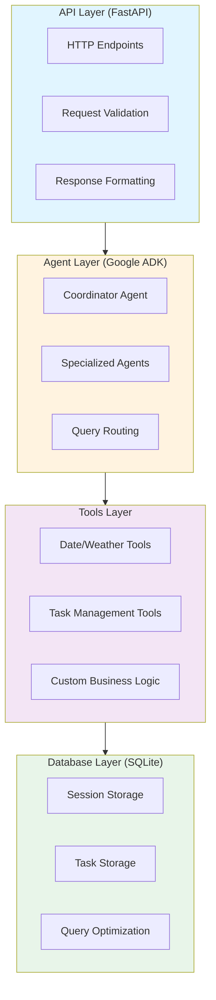
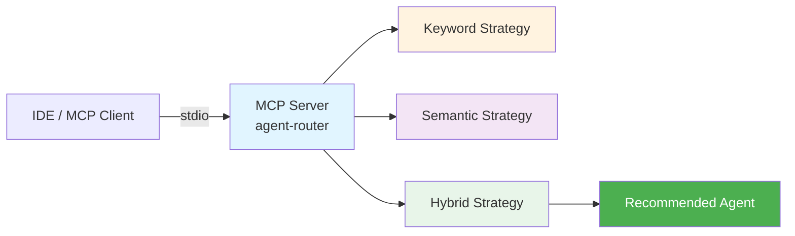
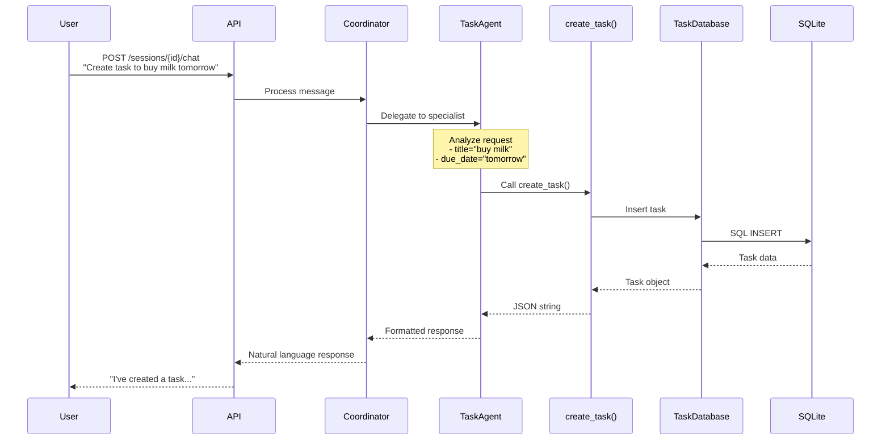
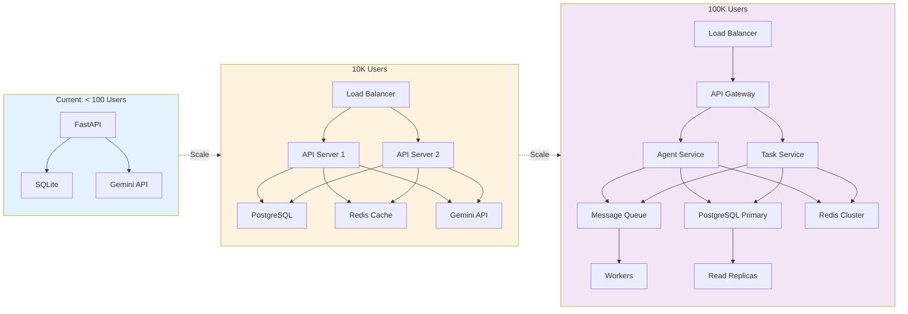
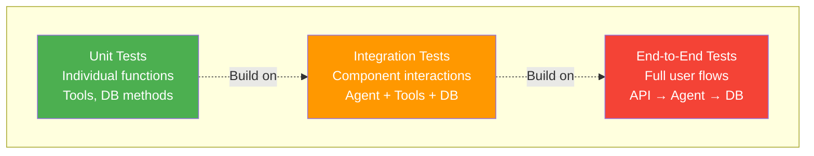

# Architecture Guide

## System Architecture

This document provides a deep dive into the architectural decisions and patterns used in this multi-agent system.

## Overview

The system follows a **layered architecture** with clear separation of concerns:



## Key Architectural Patterns

### 1. Coordinator Pattern

The **Coordinator Agent** acts as the entry point and intelligently routes queries to specialized agents.

**Benefits:**

- Single interface for users
- Easy to add new specialized agents
- Agents can be developed independently
- Clear separation of responsibilities

**Implementation:**

```python
coordinator_agent = LlmAgent(
    name="coordinator",
    model="gemini-2.5-flash",
    description="Routes queries to specialized agents",
    sub_agents=[date_agent, weather_agent, task_agent]
)
```

### 2. Tool-Based Extension

Agents gain capabilities through **tools** - Python functions that they can call.

**Benefits:**

- Reusable business logic
- Testable in isolation
- Type-safe with Python type hints
- Easy to add new capabilities

**Example:**

```python
def create_task(title: str, description: str = "", ...) -> str:
    """Create a new task."""
    task = task_db.create_task(...)
    return json.dumps(task)

task_agent = LlmAgent(
    tools=[create_task, list_tasks, ...]
)
```

### 3. Repository Pattern

Database operations are encapsulated in dedicated classes (repositories).

**Benefits:**

- Abstract database implementation
- Easier to test with mocks
- Consistent interface for data access
- Can swap SQLite for PostgreSQL later

**Example:**

```python
class TaskDatabase:
    def create_task(self, ...):
        """Create task in database."""
        ...

    def get_task(self, task_id):
        """Retrieve task by ID."""
        ...
```

### 4. Session Management

Conversations are stateful with persistent session storage.

**Benefits:**

- Context retention across messages
- Multi-user support
- Conversation history
- Audit trail

**Flow:**

1. Create session → Get session_id
2. Send messages with session_id
3. Agent has access to conversation history
4. Query history or delete session

### 5. RESTful API Design

Standard HTTP methods mapped to operations.

**Benefits:**

- Industry standard
- Easy to integrate
- Self-documenting with OpenAPI
- Works with any HTTP client

**Mapping:**

- POST → Create resource
- GET → Read resource
- PUT → Update resource
- DELETE → Delete resource

### 6. MCP Agent Router

A [Model Context Protocol](https://modelcontextprotocol.io/) server that provides query classification and sub-agent routing as IDE-accessible tools.

**Benefits:**

- Deterministic routing without LLM calls
- Multiple strategies to compare (keyword, semantic, hybrid)
- Batch classification for testing routing accuracy
- Pluggable into any MCP-compatible IDE

**Architecture:**



**Tools exposed:**

- `analyze_query` - Classify a single query
- `compare_strategies` - Side-by-side strategy comparison
- `batch_route` - Classify multiple queries
- `list_agents` - View agent registry

**Configuration** (`.cursor/mcp.json`):

```json
{
  "agent-router": {
    "command": "uv",
    "args": ["run", "--directory", "/path/to/project", "python", "-m", "mcp_server.router"]
  }
}
```

## Component Responsibilities

### API Layer (`api.py`)

**Responsibilities:**

- HTTP request handling
- Input validation (Pydantic models)
- Authentication (future)
- Response formatting
- Error handling
- CORS configuration

**Does NOT:**

- Business logic
- Direct database access
- LLM interaction

### Agent Layer (`src/agents/`)

**Responsibilities:**

- Query understanding
- Task decomposition
- Sub-agent coordination
- Response generation

**Does NOT:**

- HTTP concerns
- Database operations (uses tools)
- Direct data manipulation

### Tools Layer (`src/tools/`)

**Responsibilities:**

- Business logic implementation
- Data transformation
- External API calls
- Database operations (via repositories)

**Does NOT:**

- HTTP concerns
- Agent decision-making
- Session management

### Database Layer (`src/database/`)

**Responsibilities:**

- CRUD operations
- Query optimization
- Schema management
- Data integrity

**Does NOT:**

- Business logic
- HTTP concerns
- AI/LLM interaction

## Data Flow

### Example: Creating a Task via Chat



## Scalability Considerations

### Current Limitations

1. **SQLite** - Single file database
   - Good for: < 100K tasks
   - Limitation: Single write at a time

2. **Synchronous Processing** - Async but sequential
   - Good for: < 100 concurrent users
   - Limitation: No parallel agent execution

3. **In-Memory Sessions** - Session data in memory
   - Good for: Single server deployment
   - Limitation: Lost on restart

### Scaling Strategies

#### Architecture Evolution



#### To 10K Users

1. **Database**:
   - Migrate to PostgreSQL
   - Add connection pooling
   - Index optimization

2. **Caching**:
   - Redis for sessions
   - Cache agent responses
   - Rate limiting

3. **Infrastructure**:
   - Load balancer
   - Multiple API servers
   - Shared database

#### To 100K Users

1. **Database**:
   - Read replicas
   - Sharding by user_id
   - Separate analytics database

2. **Services**:
   - Microservices architecture
   - Message queue (RabbitMQ/Kafka)
   - Background workers

3. **AI**:
   - Model caching
   - Batch processing
   - Streaming responses

## Security Considerations

### Current Implementation

- Environment-based configuration
- No hardcoded credentials
- Input validation (Pydantic)
- CORS configuration
- No authentication
- No authorization
- No rate limiting
- No encryption

### Production Recommendations

1. **Authentication**:
   - JWT tokens
   - OAuth 2.0
   - API keys

2. **Authorization**:
   - Role-based access control (RBAC)
   - User can only access own data
   - Admin endpoints protected

3. **Data Protection**:
   - HTTPS only
   - Database encryption at rest
   - Secure credential storage (Vault)

4. **Rate Limiting**:
   - Per-user limits
   - Per-endpoint limits
   - Prevent abuse

5. **Input Validation**:
   - SQL injection prevention (already using parameterized queries)
   - XSS prevention
   - Size limits

## Testing Strategy

### Testing Pyramid



### Unit Tests

Test individual components in isolation:

```python
def test_create_task():
    db = TaskDatabase()
    task = db.create_task(title="Test")
    assert task["title"] == "Test"
```

**Coverage:**

- Database methods
- Tool functions
- Utility functions

### Integration Tests

Test component interactions:

```python
def test_task_agent_creates_task():
    response = coordinator_agent.process(
        "Create a task to test this"
    )
    # Verify task was created in database
```

**Coverage:**

- Agent + Tools
- Tools + Database
- Agent routing

### End-to-End Tests

Test full user flows:

```python
def test_chat_creates_task():
    # Create session
    # Send chat message
    # Verify response
    # Verify task in database
```

**Coverage:**

- Complete API flows
- Session management
- Multi-agent coordination
- Database persistence

## Extensibility

### Adding a New Agent

```python
# 1. Define tools
def my_tool() -> str:
    return "result"

# 2. Create agent
new_agent = LlmAgent(
    name="new_agent",
    model="gemini-2.5-flash",
    description="Purpose",
    tools=[my_tool]
)

# 3. Add to coordinator
coordinator_agent = LlmAgent(
    sub_agents=[..., new_agent]
)
```

### Adding a New Database Table

```python
# 1. Add schema
cursor.execute("""
    CREATE TABLE new_table (
        id INTEGER PRIMARY KEY,
        ...
    )
""")

# 2. Add methods
def create_item(self, ...):
    cursor.execute("INSERT INTO...")

# 3. Create tools
def create_item_tool(...) -> str:
    db.create_item(...)

# 4. Add to agent
agent.tools.append(create_item_tool)
```

## Monitoring & Observability

### Recommended Additions

1. **Logging**:
   - Structured logging (JSON)
   - Log levels per component
   - Request/response logging

2. **Metrics**:
   - Request count
   - Response time
   - Error rate
   - Agent usage

3. **Tracing**:
   - OpenTelemetry
   - Request flow tracking
   - Performance bottlenecks

4. **Alerting**:
   - Error rate spikes
   - Slow responses
   - Database issues

## Performance Optimization

### Current Performance

- **API Response**: ~500-2000ms (depends on LLM)
- **Database Queries**: <10ms
- **Tool Execution**: <50ms

### Optimization Strategies

1. **Caching**:
   - Cache agent responses
   - Cache database queries
   - TTL-based invalidation

2. **Async Processing**:
   - Background tasks
   - Webhooks for results
   - Streaming responses

3. **Database**:
   - Index commonly queried fields
   - Query optimization
   - Connection pooling

4. **LLM**:
   - Smaller models for simple queries
   - Prompt optimization
   - Batch requests

## Deployment

### Development

```bash
python api.py
```

### Docker

```bash
# Build and run with docker-compose
docker compose up --build

# Or build and run manually
docker build -t adk-agent-system-demo .
docker run -p 8000:8000 --env-file .env adk-agent-system-demo
```

### Production (Cloud)

- **Google Cloud Run** - Serverless containers
- **AWS ECS/Fargate** - Container orchestration
- **Heroku** - Platform as a service
- **Railway/Fly.io** - Modern platforms

## Conclusion

This architecture prioritizes:

1. **Simplicity** - Easy to understand and modify
2. **Modularity** - Components can be developed independently
3. **Extensibility** - Easy to add new features
4. **Maintainability** - Clear patterns and organization
5. **Production-Ready** - Follows best practices

The system is designed to be a **learning reference** while also being **production-capable** with minimal changes.
