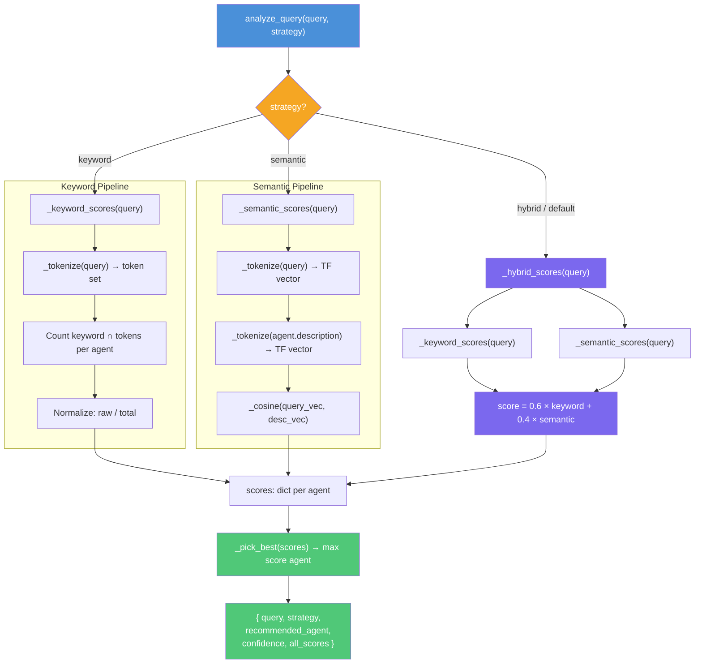

# Router Internals — Deep Dive

This document walks through every step of the agent router in
`mcp_server/router.py`, including the full math behind keyword scoring,
semantic scoring, and the hybrid combination.

---

## 1. Agent Registry

Three agents are registered at module level:

| Agent           | Description                                    | Keywords                                                                                                                             |
| -----------------| ------------------------------------------------| --------------------------------------------------------------------------------------------------------------------------------------|
| `date_agent`    | Dates, time, day-of-week, calendar             | date, time, today, tomorrow, yesterday, day, week, month, year, calendar, clock, when                                                |
| `weather_agent` | Weather conditions and forecasts               | weather, temperature, rain, sunny, cloudy, storm, forecast, humidity, wind, snow, hot, cold, climate                                 |
| `task_agent`    | Task CRUD, analytics, overdue tracking, search | task, todo, create, delete, update, complete, overdue, due, priority, pending, list, show, statistics, stats, search, assign, manage |

Each agent is an `AgentInfo` dataclass with `name`, `description`, and `keywords`.

---

## 2. Tokenization

All strategies share a single tokenizer:

```python
def _tokenize(text: str) -> list[str]:
    return re.findall(r"[a-z]+", text.lower())
```

1. Convert the input to **lowercase**.
2. Extract all contiguous runs of `[a-z]` characters.
3. Numbers, punctuation, and whitespace are discarded.

**Example:**  
`"Will it rain in Berlin this weekend?"` → `["will", "it", "rain", "in", "berlin", "this", "weekend"]`

---

## 3. Keyword Scoring

```python
def _keyword_scores(query: str) -> dict[str, float]:
    tokens = set(_tokenize(query))
    raw = {}
    for agent in AGENTS:
        raw[agent.name] = sum(1 for kw in agent.keywords if kw in tokens)
    total = sum(raw.values()) or 1
    return {name: count / total for name, count in raw.items()}
```

### Step-by-step

1. **Tokenize** the query and convert to a **set** (duplicates removed).
2. For each agent, count how many of its keywords appear in the token set.
3. Sum all raw counts across all agents → `total`.
4. Divide each agent's raw count by `total` to normalize.

### Math — Keyword Normalization

Let $Q$ be the set of query tokens. For agent $i$ with keyword set $K_i$:

$$\text{raw}_i = |K_i \cap Q|$$

$$\text{total} = \sum_{i} \text{raw}_i$$

$$\text{keyword\_score}_i = \frac{\text{raw}_i}{\text{total}}$$

All keyword scores sum to **1.0** (they form a probability distribution). If no keywords match any agent, `total` defaults to 1 to avoid division by zero, and all scores are 0.

### Worked Example

Query: `"Will it rain tomorrow?"`  
Tokens (set): `{will, it, rain, tomorrow}`

| Agent | Matching keywords | Raw count |
|-------|-------------------|-----------|
| `date_agent` | tomorrow | 1 |
| `weather_agent` | rain | 1 |
| `task_agent` | *(none)* | 0 |

`total = 1 + 1 + 0 = 2`

| Agent | Score |
|-------|-------|
| `date_agent` | 1/2 = **0.5** |
| `weather_agent` | 1/2 = **0.5** |
| `task_agent` | 0/2 = **0.0** |

---

## 4. Semantic Scoring

"Semantic" scoring computes **cosine similarity** between term-frequency (TF) vectors of the query and each agent's description.

### 4a. Term-Frequency Vector

```python
def _term_freq(tokens: list[str]) -> dict[str, float]:
    freq = {}
    for t in tokens:
        freq[t] = freq.get(t, 0) + 1
    length = math.sqrt(sum(v * v for v in freq.values())) or 1
    return {k: v / length for k, v in freq.items()}
```

1. Count occurrences of each token → raw frequency vector.
2. Compute the **L2 norm** (Euclidean length) of the vector.
3. Divide every component by the L2 norm → **unit vector**.

#### Math — TF Normalization

Given tokens $[t_1, t_2, \ldots, t_n]$, the raw frequency of term $w$ is:

$$f(w) = |\{j : t_j = w\}|$$

The L2 norm is:

$$\|f\| = \sqrt{\sum_{w} f(w)^2}$$

The normalized TF vector is:

$$\hat{f}(w) = \frac{f(w)}{\|f\|}$$

#### Worked Example — TF Vector

Tokens: `["will", "it", "rain", "in", "berlin", "this", "weekend"]`

All tokens appear once, so raw freq = 1 for each.

$$\|f\| = \sqrt{1^2 + 1^2 + 1^2 + 1^2 + 1^2 + 1^2 + 1^2} = \sqrt{7} \approx 2.6458$$

Each component: $\hat{f}(w) = 1 / \sqrt{7} \approx 0.3780$

### 4b. Cosine Similarity

```python
def _cosine(a: dict[str, float], b: dict[str, float]) -> float:
    keys = set(a) & set(b)
    if not keys:
        return 0.0
    return sum(a[k] * b[k] for k in keys)
```

Since both vectors are already **L2-normalized**, the dot product equals the cosine similarity directly:

$$\cos(\theta) = \frac{\vec{a} \cdot \vec{b}}{\|\vec{a}\| \|\vec{b}\|} = \vec{\hat{a}} \cdot \vec{\hat{b}} = \sum_{w \in A \cap B} \hat{a}(w) \cdot \hat{b}(w)$$

Only **shared terms** (intersection of keys) contribute. The result is in the range **[0, 1]** (no negative values since all frequencies are non-negative).

### 4c. Full Semantic Scoring Pipeline

```python
def _semantic_scores(query: str) -> dict[str, float]:
    q_vec = _term_freq(_tokenize(query))
    scores = {}
    for agent in AGENTS:
        desc_vec = _term_freq(_tokenize(agent.description))
        scores[agent.name] = round(_cosine(q_vec, desc_vec), 4)
    return scores
```

For each agent:

1. Tokenize the agent's **description** string.
2. Build its L2-normalized TF vector.
3. Compute cosine similarity with the query's TF vector.
4. Round to 4 decimal places.

### Worked Example — Semantic Scoring

Query: `"Will it rain tomorrow?"`  
Query tokens: `["will", "it", "rain", "tomorrow"]`  
Query TF vector (each appears once): each component = $1/\sqrt{4} = 0.5$

**vs. `weather_agent` description:**  
`"Handles questions about weather conditions and forecasts for locations"`  
Tokens: `["handles", "questions", "about", "weather", "conditions", "and", "forecasts", "for", "locations"]` (9 unique tokens, each freq = 1)  
Each component = $1/\sqrt{9} = 1/3 \approx 0.3333$

Shared terms: **none** (`rain` ≠ `rain` is not in the description; `rain` is a keyword but not in the description text)

$$\cos = 0.0$$

**vs. `date_agent` description:**  
`"Handles questions about dates, time, day of week, and calendar information"`  
Tokens: `["handles", "questions", "about", "dates", "time", "day", "of", "week", "and", "calendar", "information"]` (11 unique)  
Each component = $1/\sqrt{11} \approx 0.3015$

Shared terms: **none** (`tomorrow` is a keyword, not in the description)

$$\cos = 0.0$$

> **Key insight:** Semantic scores depend on the agent **description** text, not the keyword list. If the query uses words not found in any description, all semantic scores will be 0. This is a bag-of-words limitation — it is not true embedding-based semantic similarity.

---

## 5. Hybrid Scoring

```python
def _hybrid_scores(
    query: str,
    keyword_weight: float = 0.6,
    semantic_weight: float = 0.4,
) -> dict[str, float]:
    kw = _keyword_scores(query)
    sem = _semantic_scores(query)
    combined = {}
    for name in kw:
        combined[name] = round(
            keyword_weight * kw[name] + semantic_weight * sem[name], 4
        )
    return combined
```

### Math

For each agent $i$:

$$\text{hybrid}_i = 0.6 \times \text{keyword}_i + 0.4 \times \text{semantic}_i$$

This is a **weighted linear interpolation** with fixed default weights:

- **0.6** for keyword scores (precision-oriented)
- **0.4** for semantic scores (recall-oriented)

The weights are parameters but are **not exposed** through the MCP tool interface — `analyze_query` always calls `_hybrid_scores(query)` with defaults.

### Properties

- If semantic scores are all 0 (no term overlap with descriptions), hybrid scores reduce to `0.6 × keyword_scores`.
- Hybrid scores do **not** necessarily sum to 1 (keyword scores sum to 1, but semantic scores do not).
- The result is rounded to 4 decimal places per agent.

### Worked Example — Hybrid Scoring

Query: `"Will it rain tomorrow?"`

| Agent | Keyword | Semantic | Hybrid |
|-------|---------|----------|--------|
| `date_agent` | 0.5 | 0.0 | 0.6 × 0.5 + 0.4 × 0.0 = **0.3** |
| `weather_agent` | 0.5 | 0.0 | 0.6 × 0.5 + 0.4 × 0.0 = **0.3** |
| `task_agent` | 0.0 | 0.0 | 0.6 × 0.0 + 0.4 × 0.0 = **0.0** |

Tie between `date_agent` and `weather_agent` — `_pick_best` uses `max()`, which returns the **first** max encountered (iteration order of the dict).

---

## 6. Agent Selection

```python
def _pick_best(scores: dict[str, float]) -> str:
    return max(scores, key=scores.get)
```

Returns the agent name with the highest score. In case of a tie, Python's `max()` returns the first one encountered in iteration order (insertion order for dicts in Python 3.7+).

---

## 7. MCP Tool Interface

The router exposes four tools via FastMCP:

| Tool | Purpose |
|------|---------|
| `list_agents` | Returns all registered agents with descriptions and keywords |
| `analyze_query(query, strategy)` | Scores a single query using the chosen strategy and returns the recommended agent |
| `compare_strategies(query)` | Runs all three strategies side-by-side; overall recommendation = hybrid winner |
| `batch_route(queries, strategy)` | Maps `analyze_query` over a list of queries |

### `analyze_query` flow



---

## 8. Limitations & Notes

- **Not true semantic search.** The "semantic" strategy uses bag-of-words cosine similarity on raw text, not neural embeddings. It cannot understand synonyms or paraphrases.
- **Keyword scores are globally normalized.** If a query matches keywords across multiple agents, the scores reflect the *proportion* of total matches, not absolute match quality.
- **Semantic scores compare against descriptions only.** The keyword list is ignored during semantic scoring. An agent's keywords and description can diverge significantly.
- **Hybrid weights are hardcoded at the tool level.** The `_hybrid_scores` function accepts weight parameters, but `analyze_query` does not pass them through.
- **Tie-breaking is non-deterministic in spirit.** While Python dict ordering is stable, ties are broken by agent registration order, not by any meaningful tiebreaker.
- **No unknown/fallback agent.** If no agent matches well, the router still picks the highest-scoring one, even if all scores are 0.
